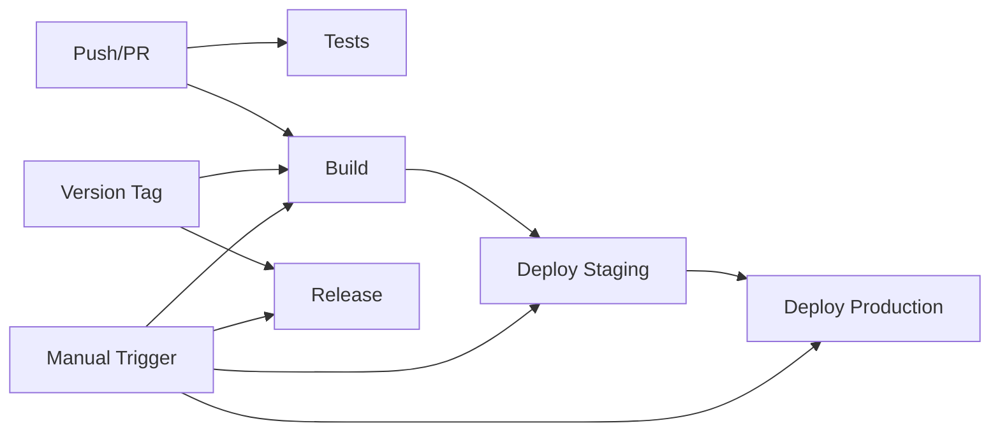

# GitHub Actions Workflows

This directory contains CI/CD workflows for the dnd_notetaker project, specifically for the audio_extract module.

## Overview

The workflows are designed to provide a complete CI/CD pipeline:
1. **Test** → Run tests on code changes
2. **Build** → Create Docker images
3. **Deploy** → Deploy to staging/production
4. **Release** → Create versioned releases

## Workflow Files

### 1. tests.yml - Automated Testing
**Purpose**: Run comprehensive tests for code quality assurance

**Triggers**:
- Push to main/master branches
- Pull requests to main/master branches

**What it does**:
- Tests on Python 3.10 and 3.12 (minimum and maximum supported versions)
- Runs tests for both the main repository and audio_extract module
- Generates and uploads coverage reports to Codecov

**Key features**:
- Parallel test execution for faster feedback
- Coverage reporting for code quality metrics
- Separate test suites for different components

### 2. build-audio-extract.yml - Docker Image Building
**Purpose**: Build and push Docker images to GitHub Container Registry

**Triggers**:
- Push to main/master with changes in `audio_extract/`
- Version tags matching `audio-extract-v*`
- Manual workflow dispatch with custom tags

**What it does**:
- Builds Docker images with proper tagging
- Tests images before pushing
- Pushes to GitHub Container Registry (ghcr.io)
- Generates build summaries

**Image tags created**:
- `sha-{commit-sha}` - Always created for every build
- `latest` - Updated on main/master branch pushes
- `v{version}` - Created for version tags
- Custom tags - When manually triggered

### 3. deploy-audio-extract.yml - Deployment Pipeline
**Purpose**: Deploy the audio-extract service to staging and production

**Triggers**:
- Automatically after successful builds on main/master (staging only)
- Manual workflow dispatch for staging or production

**Deployment flow**:
1. **Staging deployment**:
   - Automatic after successful builds
   - Zero-downtime rolling deployment
   - Health checks and smoke tests
   - Rollback on failure

2. **Production deployment**:
   - Manual trigger only
   - Requires staging success (when applicable)
   - Additional verification steps
   - Comprehensive health checks

**Key features**:
- SSH-based deployment to remote servers
- Docker Compose orchestration
- Automatic rollback on health check failure
- Deployment summaries and logs

### 4. release-audio-extract.yml - Release Management
**Purpose**: Create GitHub releases with changelogs and artifacts

**Triggers**:
- Version tags matching `audio-extract-v*`
- Manual workflow dispatch with version input

**What it does**:
- Generates changelog from commits
- Creates configuration and documentation archives
- Tags Docker images with version numbers
- Creates GitHub release with artifacts

**Release artifacts**:
- `audio-extract-configs.tar.gz` - Configuration examples
- `audio-extract-docs.tar.gz` - Documentation files

## Required Secrets

### Container Registry (Automatic)
- `GITHUB_TOKEN` - Automatically provided by GitHub Actions

### Deployment Infrastructure
**Staging Environment**:
- `STAGING_HOST` - Hostname/IP of staging server
- `STAGING_USER` - SSH username for staging
- `STAGING_SSH_KEY` - SSH private key for staging access
- `STAGING_URL` - Base URL for staging health checks

**Production Environment**:
- `PRODUCTION_HOST` - Hostname/IP of production server
- `PRODUCTION_USER` - SSH username for production
- `PRODUCTION_SSH_KEY` - SSH private key for production access
- `PRODUCTION_URL` - Base URL for production health checks

### Application Configuration
- `GCS_BUCKET_NAME` - Google Cloud Storage bucket name
- `AUDIO_EXTRACT_FOLDER_ID` - Google Drive folder ID to monitor
- `GCS_SERVICE_ACCOUNT_KEY` - GCS service account credentials (if needed)

### Optional Integrations
- `CODECOV_TOKEN` - For coverage reporting (optional, public repos work without it)
- `SLACK_WEBHOOK` - For deployment notifications (optional)

## Usage Examples

### Manual Deployment
```bash
# Deploy latest to staging
gh workflow run deploy-audio-extract.yml \
  -f environment=staging \
  -f image_tag=latest

# Deploy specific version to production
gh workflow run deploy-audio-extract.yml \
  -f environment=production \
  -f image_tag=v1.2.3

# Deploy specific SHA to staging
gh workflow run deploy-audio-extract.yml \
  -f environment=staging \
  -f image_tag=sha-abc123def456
```

### Manual Build
```bash
# Build with custom tag
gh workflow run build-audio-extract.yml \
  -f tag_name=my-feature-test
```

### Create Release
```bash
# Create a new release
gh workflow run release-audio-extract.yml \
  -f version=1.2.3 \
  -f prerelease=false

# Create a pre-release
gh workflow run release-audio-extract.yml \
  -f version=2.0.0-beta.1 \
  -f prerelease=true
```

## Environment Setup

### 1. GitHub Environments
Create environments in repository settings:
- **staging** - For testing deployments
- **production** - For live deployments

### 2. Protection Rules
Recommended protection rules for production:
- Required reviewers
- Restrict who can deploy
- Wait timer (optional)

### 3. Secrets Configuration
Add secrets at the repository or environment level:
- Repository secrets: Shared across all workflows
- Environment secrets: Specific to staging/production

### 4. Branch Protection
Protect main/master branches:
- Require PR reviews
- Require status checks (tests)
- Require branches to be up to date

## Docker Compose Integration

The deployment workflows expect Docker Compose files on the target servers:

**Staging** (`docker-compose.staging.yml`):
```yaml
services:
  audio-extract:
    image: ${AUDIO_EXTRACT_IMAGE}
    # ... configuration
```

**Production** (`docker-compose.prod.yml`):
```yaml
services:
  audio-extract:
    image: ${AUDIO_EXTRACT_IMAGE}
    environment:
      - GCS_BUCKET_NAME=${GCS_BUCKET_NAME}
      - AUDIO_EXTRACT_FOLDER_ID=${AUDIO_EXTRACT_FOLDER_ID}
    # ... configuration
```

## Troubleshooting

### Build Failures
1. Check workflow logs in Actions tab
2. Verify Dockerfile syntax and context
3. Ensure all required files are present

### Deployment Failures
1. **SSH Connection Issues**:
   - Verify SSH key is correctly formatted
   - Check server allows key-based authentication
   - Ensure correct username and hostname

2. **Health Check Failures**:
   - Check application logs on server
   - Verify health endpoint is accessible
   - Ensure required environment variables are set

3. **Image Pull Failures**:
   - Verify image tag exists in registry
   - Check network connectivity from server
   - Ensure registry authentication (if private)

### Release Issues
1. **Tag Format**: Must match `audio-extract-v*` pattern
2. **Permissions**: Need write access to create releases
3. **Artifacts**: Ensure source files exist before archiving

## Best Practices

1. **Version Tags**: Use semantic versioning (e.g., v1.2.3)
2. **Testing**: Always test in staging before production
3. **Rollback Plan**: Keep previous images for quick rollback
4. **Monitoring**: Check health endpoints after deployment
5. **Documentation**: Update this README when workflows change

## Workflow Dependencies



## Security Considerations

1. **Secrets**: Never commit secrets to the repository
2. **SSH Keys**: Use dedicated deploy keys with limited permissions
3. **Environment Isolation**: Separate credentials for staging/production
4. **Image Scanning**: Consider adding vulnerability scanning
5. **Audit Trail**: All deployments are logged in GitHub Actions

## Future Improvements

Consider adding:
- Automated rollback on metric degradation
- Blue-green deployment strategy
- Database migration automation
- Slack/Discord notifications
- Performance testing gates
- Security scanning in build pipeline